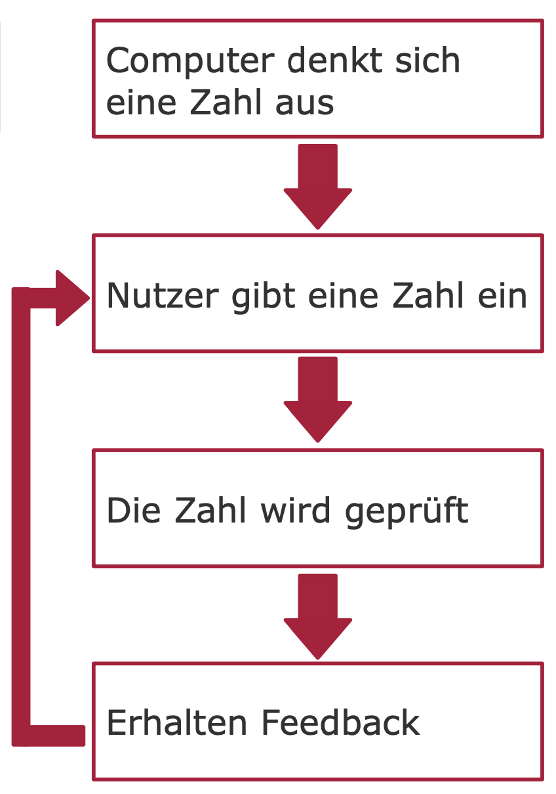
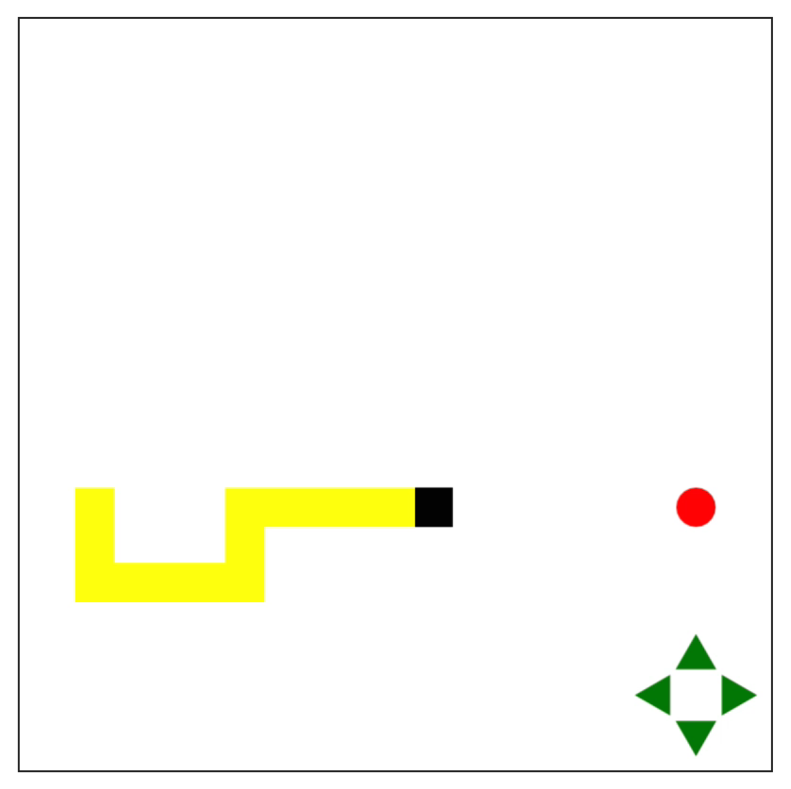
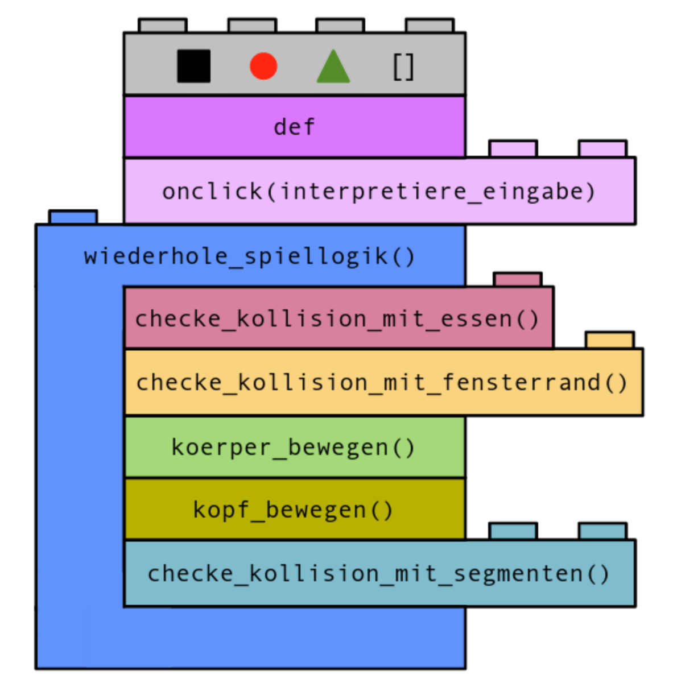

=======================
Zusammenfassung Woche 4
=======================

Eingabe
=======

`input(string)`
    Ermöglicht es, Tastatureingabe zu erhalten
    Gibt die Antwort des Nutzers als String zurück
`int(string_oder_zahl)`
    Wandelt einen String in einen Integer um
    z.B. "2" in 2
    Versucht man mit der Funktion einen String, der nicht nur aus Zahlen besteht, 
    in eine Zahl umzuwandeln, erhält man einen ValueError
`float(string)`
    Wandelt einen String in einen Float um
    z.B. "1.5" in 1.5

Fehlerbehandlung
================

.. code-block:: console
   try:
     # Anweisungen
   except fehlerart:
     # Anweisungen

Fängt die Fehlerart ab, die hinter dem except angegeben ist
Tritt ein Fehler dieser Fehlerart in dem eingerückten Teil hinter dem try auf, 
werden die eingerückten Zeilen hinter dem except ausgeführt

Zahlenraten
===========

    Ziel des Spiels: Mit so wenigen Anfragen wie möglich die Zahl des Computers erraten

Programmablauf
--------------

    Programmablauf Zahlenraten

Am Anfang wird mit der Funktion `randint(1,100)` eine zufällige Zahl zwischen 1 und 100 festgelegt.
Der Nutzer kann eine Zahl eingeben. Dafür verwenden wir die Funktionen `input()` und `int()`.
Mit Hilfe einer Verzweigung wird überprüft, ob die eingegebene Zahl zu groß, zu klein oder die richtige Zahl ist.
    Hat der Nutzer bereits die richtige Zahl eingegeben, ist das Spiel zu Ende.
    Hat der Nutzer noch nicht die richtige Zahl eingegeben, wiederholen sich die Schritte von 2 bis 4 solange, bis die richtige Zahl erraten wurde.
    Dieses Wiederholen wird mit Hilfe einer While-Schleife und einer Variable gefunden ermöglicht.
    Es wird ein ValueError wird mit Hilfe der Schlüsselwörter try: und except: ValueError abgefangen.

Snake-Spiel
===========

    Snake Spiel

Ziel des Spiels: Schlange fängt ihr Essen ein, um so groß wie möglich zu werden
Schlange bewegt sich per Mausklick auf die Steuerung oder über die Pfeiltasten
Spiel ist verloren, wenn Schlange mit Fensterrand oder sich selbst kollidiert

Programmablauf
--------------

    Programmablauf Snake

1. Zuerst werden verschiedene (Turtle-)Grafiken und Funktionen definiert.
2. `onclick(interpretiere_eingabe)` gibt Koordinaten des Mausklicks an `interpretiere_eingabe()` weiter, wenn auf Bildschirm geklickt wurde.
3. `interpretiere_eingabe()` wertet diese Koordinaten aus und führt zur Änderung der Kopfrichtung, wenn das dementsprechende Steuerungsdreieck angeklickt wurde.
4. Folgendes wird während des Spiels immer wieder in einer Schleife aufgerufen:
    - Wenn der Schlangenkopf mit dem Essen kollidiert, wird das Essen neu platziert und die Schlange vergrößert.
    - Wenn der Schlangenkopf über den Fensterrand hinausläuft, ist das Spiel verloren und wird neu gestartet.
    - Die Schlange wird über `koerper_bewegen()` und `kopf_bewegen()` im Rasterfeld mit 20x20-Feldern bewegt.
    - Läuft der Schlangenkopf in den Schlangenkörper, ist das Spiel vorbei und wird neu gestartet.

Mehrere Turtle-Grafiken
-----------------------

`Turtle() erzeugt eine neue Turtle-Grafik, wodurch mehrere Turtle-Grafiken gleichzeitig existieren können

    Jede Turtle kann eigener Variable zugeordnet werden

    `schildkroete = Turtle()`

Funktionen aus Turtle-Bibliothek müssen über Punktnotation auf dieser Variable aufgerufen werden

    `schildkroete.forward(150)`

`turtle1.distance(turtle2)` gibt den Abstand der Mittelpunkte von turtle1 und turtle2 zurück

